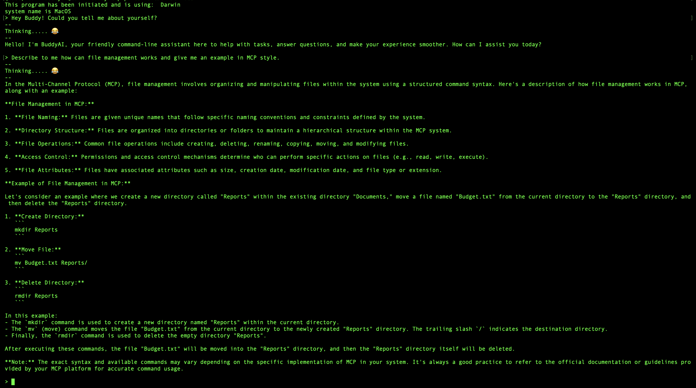
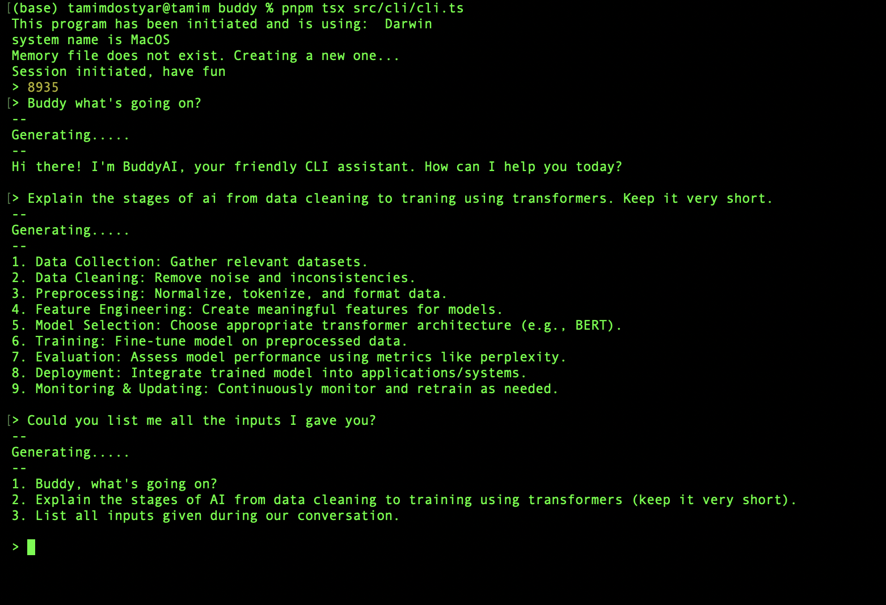

# Buddy

Small CLI-oriented helper for everyday tasks. Keep it simple: you talk to Buddy from the terminal; skills handle focused jobs like time and notes.

## Why TypeScript? 


Buddy is written in TypeScript because it gives static types and fast editor feedback across a growing CLI, config, and service surface, which catches integration mistakes early and makes refactors safer. The same language and tooling cover scripts and Node-style async I/O, so HTTP, subprocesses, and file work stay straightforward, and npm’s ecosystem stays available for whatever Buddy needs to talk to. It is not the tool for kernel-level or hard real-time work, but for a terminal-first helper that orchestrates everyday tasks, TypeScript is a practical balance of safety, speed of change, and library support.

## Run (placeholder)

- Entrypoint and package scripts are not wired yet. When they are, this section will list the exact command (for example, how to invoke the CLI in [`src/cli/cli.ts`](src/cli/cli.ts)).

## Repo layout (high level)

- `pnpm tsx src/cli/cli.ts `

- `src/` — core code: CLI, config, memory, system service.
- `skills/` — one folder per skill; each skill has a short `.md` describing what it will do.
- `ui/` — plans for terminal vs any future interface.
- `security/` — notes on system security and threading/concurrency expectations.

## Example

This screenshot shows Buddy running in the terminal:



Here is the working session feature for the system.


I am currently building an OS that I eventually plan to connect with this software. Check out my [OS repository here](https://github.com/TamimDostyar/operating-system).

## Goals

- Replace Ollama with buddyGPT as the AI backend — no external runtime, no cloud dependency, no model that someone else owns
- Migrate from a TypeScript/Node.js CLI running on macOS to a native process running inside buddyOS
- Evolve into BuddyShell — the AI-native shell where typing a command and talking to the AI are the same action
- Use the `.memoryChatSession/` history as training data so the model learns each user's habits over time
- Eventually have no separation between "terminal" and "AI assistant" — one prompt, one interface, one language

---

## Architecture

How input travels through buddyCLI today, and how it will travel through BuddyShell.

```
  TODAY                                   FUTURE (BuddyShell inside buddyOS)
  ─────────────────────────────────       ────────────────────────────────────────

  $ pnpm tsx src/cli/cli.ts               buddy> _
  buddy> what time is it                  buddy> open the file I was editing
                                                 about the networking bug
      │                                       │
      ▼                                       │  sys_ask()  (natural-language syscall)
  cli.ts                                      ▼
      │                               buddyGPT  (kai/ kernel subsystem)
      │                                       │
      ▼                                       │  reads live kernel state:
  systemService                               │  · semantic FS index
  .ollamaIntelligence()                       │  · process table
      │                                       │  · recent file access log
      │  HTTP  →  Ollama                      │
      ▼                                       ▼ decides:
  downloaded model                    ┌───────────────────────┐
  responds                            │  command?             │──► exec syscall
                                      │  natural language?    │──► text answer at buddy>
      │                               │  need the internet?   │──► fetch online, run it
      ▼                               └───────────────────────┘
  console.log(chat)
  shown in terminal                   shown at  buddy>  with full kernel context


  Session saved to:  .memoryChatSession/   ←── becomes training data for buddyGPT
```


## REPOSITORIES:
- [buddyOS](https://github.com/TamimDostyar/buddyOS)
- [buddyGPT](https://github.com/TamimDostyar/buddyGPT)